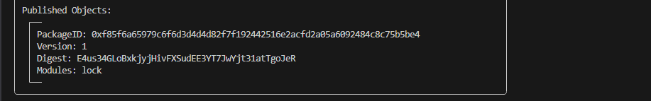
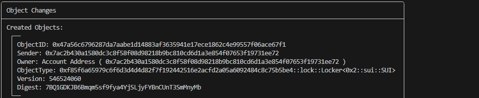

<div align="center">

# Deployment Guide: Treasury Lock Contract

</div>

This guide shows you how to deploy and use the **Treaury Lock Contract** on Sui **Testnet**.
It’s written step-by-step so **even non-programmers** can follow along.

## 1. Install Sui CLI

The **Sui CLI** is the command-line tool we’ll use to publish and interact with the contract.

1. Open a terminal (Mac/Linux) or PowerShell (Windows).
2. Install the latest Sui CLI by following the official instructions:
    [Install Sui CLI](https://docs.sui.io/guides/developer/getting-started/sui-install)

To confirm installation works, run:

```bash
sui --version
```

You should see a version number (e.g. `sui 1.x.x`).
 
---

## 2. Create or import a Sui wallet

You need a wallet address to pay gas fees.

1. Run:

   ```bash
   sui client new-address ed25519
   ```

   This creates a new wallet. Copy the **address** that appears.

2. Set it as your active address:

   ```bash
   sui client switch --address <YOUR_ADDRESS>
   ```

3. Check it:

   ```bash
   sui client active-address
   ```

---

## 3. Get Testnet SUI tokens

You need free SUI for gas.

1. Request SUI from one of these official faucets:

   * [https://faucet.sui.io](https://faucet.sui.io)
   * [https://suicet.vercel.app](https://suicet.vercel.app)

   Paste your wallet address and request tokens.

2. Check your balance:

   ```bash
   sui client balance
   ```

You should see some **SUI coins** ready for use.

---

## 4. Clone the contract repo

Download the contract code to your computer:

```bash
git clone https://github.com/notus-labs/treasury_lock_contract.git
cd lock_contract
```

---

## 5. Publish the contract

To deploy the contract on **Testnet**:

```bash
sui client publish --gas-budget 100000000
```

* After running this, you’ll see a **package ID** like:

  ```
  Package ID: 0x123...abc
  ```

 

Save this `Package ID` — it’s needed for all interactions.

---

## 6. View on Suiscan 

Go to [Suiscan Testnet](https://suiscan.xyz/testnet) and search for your package ID.
You’ll see your published contract and all future transactions.

---

## 7. Using the contract

### (a) Lock SUI

Example: Lock **5 SUI** for **60 minutes**.

```bash
sui client call \
  --package <PACKAGE_ID> \
  --module lock \
  --function lend \
  --type-args 0x2::sui::SUI \
  --args <SUI_COIN_OBJECT_ID> 60 <CLOCK_OBJECT_ID> \
  --gas-budget 100000000
```

* `<SUI_COIN_OBJECT_ID>` → one of your owned SUI coin objects (`sui client objects`).
* `<CLOCK_OBJECT_ID>` → the global clock object ID (`0x6`).

---

### (b) Lock a custom coin

Replace the type argument with your custom coin type (for example):

```
0xYOURCOINPACKAGE::your_module::YourCoin
```

---

### (c) Withdraw after lock period

Once the duration expires, withdraw:

```bash
sui client call \
  --package <PACKAGE_ID> \
  --module lock \
  --function withdraw_loan \
  --type-args 0x2::sui::SUI \
  --args <LOCKER_OBJECT_ID> <CLOCK_OBJECT_ID> \
  --gas-budget 100000000
```

* `<LOCKER_OBJECT_ID>` → the ID of the Locker object created when you called `lend`.



---

### (d) Check Locker info

You can view metadata:

```bash
sui client call \
  --package <PACKAGE_ID> \
  --module lock \
  --function get_locker_info \
  --type-args 0x2::sui::SUI \
  --args <LOCKER_OBJECT_ID> \
  --gas-budget 100000000
```

---

## 8. Important Notes

* Minimum duration = **1 minute**
* Maximum duration = **525,600 minutes (1 year)**
* Amount must be **greater than 0**
* Withdrawals before unlock time will **fail with error code `ETooEarly`**

---

You are now ready to deploy and use the **Treasury Lock Contract** on Sui Testnet.

---

